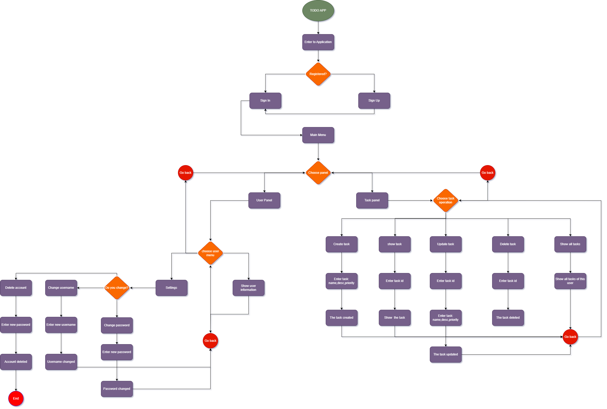

# TODO APP

---

## Task Manager Application - Flow chart


---
## Features
### User
- **User Account Creation**: Users can create an account by providing a username and password.
- **User Information**: Users can view their own account information.
- **User Tasks**: Users can view their own tasks.
- **User Account Update**: Users can update their username or password.
- **User Account Deletion**: Users can delete their own account, which also deletes associated tasks.

### Task
-  **Task Creation**: Users can create tasks by providing a name, description, and priority.
-  **Task Listing**: Display a list of all tasks with details including name, description, and priority.
-  **Task Updating**: Users can update task details including name, description, and priority.
-  **Task Deletion**: Enable users to delete tasks from the list.

---

## Technologies Used

- **Java**: The core programming language used to develop the application logic.

- **Maven**: Used as a build automation tool for managing dependencies and building the project.

- **Lombok**: Used to reduce boilerplate code by generating getters, setters, constructors, and more.

- **PostgreSQL Database**: Used to store user accounts and tasks for persistence between application sessions.

- **Data Structures**: Implemented data structures such as lists and optionals to manage tasks and user accounts efficiently.

- **Object-Oriented Programming (OOP)**: Applied OOP principles to organize code into classes and objects for better modularity and maintainability.


---


## Setup


To set up and run the Todo Console Application with User Accounts, follow these steps:

### Prerequisites

- Java Development Kit (JDK) installed on your machine. You can download it from [here](https://www.oracle.com/java/technologies/javase-jdk22-downloads.html).
- PostgreSQL installed and running on your system. You can download it from [here](https://www.postgresql.org/download/).
- Git installed on your machine. You can download it from [here](https://git-scm.com/downloads).

### Clone the Repository

1. Open your terminal or command prompt.

2. Navigate to the directory where you want to store the project.

3. Clone the GitHub repository by running the following command:

   ```
   git clone https://github.com/MuhammadanasxonMadaminov/TodoApp.git
   ```

### Database Setup

1. Start PostgreSQL and ensure it is running.

2. Create a new database for the application. You can use the following command in psql:

   ```
   CREATE DATABASE TodoApp;
   ```

3. Import the database schema using the provided SQL script. You can find the script in the `database_dump` directory of the project.

   ```
   psql -U your-username -d TodoApp -f database_dump/schema.sql
   ```

   Replace `your-username` with your PostgreSQL username.

### Configuration

1. Navigate to the `src/main/resources` directory of the project.

2. Open the `db.properties` file.

3. Update the database connection properties with your PostgreSQL username, password, and database name.

### Build and Run

1. Navigate to the root directory of the project.

2. Build the project using Maven:

   ```
   mvn clean package
   ```

3. Run the application using the generated JAR file:

   ```
   java -jar target/TodoApp.jar
   ```

### Usage

Once the application is running, follow the usage instructions provided in the README.md file.

---

## Contact

If you have any questions, suggestions, or feedback, feel free to reach out:

- **Email**: madaminovmuhammadanas@gmail.com
- **GitHub**: [My GitHub](https://github.com/MuhammadanasxonMadaminov)
- **LinkedIn**: [My LinkedIn](https://www.linkedin.com/in/muhammadanasxon-madaminov-168a51233/)
---
